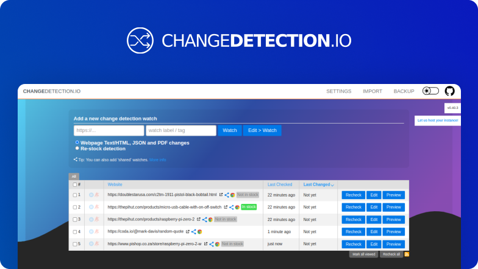
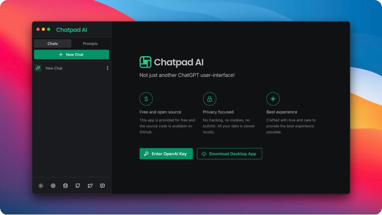
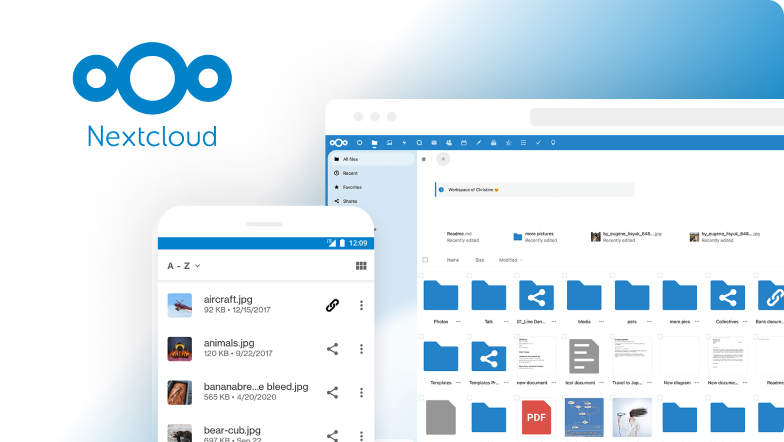
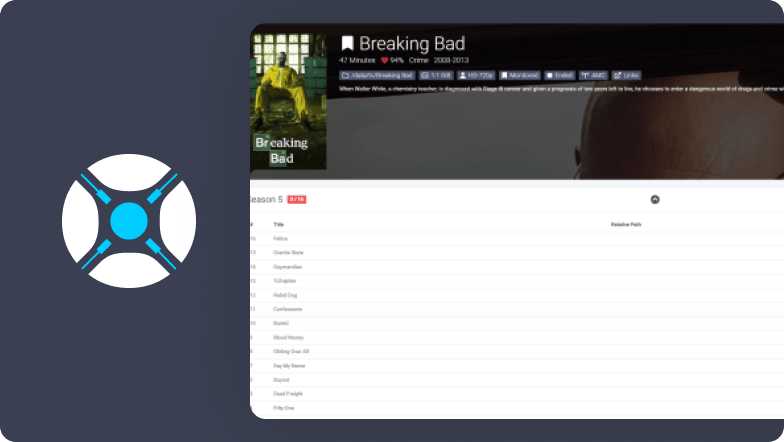

#  CasaOS-TMCstore

Believe it or not, but yet another CasaOS Community App Store based mostly on my usage and apps.

---

### Download URL:

    https://github.com/mariosemes/CasaOS-TMCstore/archive/refs/heads/main.zip
 
---

### How to install:

---

### Apps:

| Thumbnail | App |
| --- | --- |
|  | <h2> [Changedetection.io](https://changedetection.io/)</h2>    From simply monitoring website pages that have a change (such as watching prices, restock notification), to deep inspection such as PDF text support, JSON and XML monitoring and extensive text triggers. |
|  | <h2> [ChatPad AI](https://chatpad.ai/)</h2>    Free and open-source software that provides a user-friendly system for interacting with ChatGPT. |
|  | <h2> [Ghost](https://ghost.org/)</h2>    Free and open-source blogging platform. |
|  | <h2> [Nextcloud](https://github.com/crazy-max/docker-nextcloud)</h2>    Nextcloud Docker image with advanced features. More info can be found here https://github.com/crazy-max/docker-nextcloud/tree/master |
|  | <h2> [Radarr](https://radarr.video/)</h2>    Radarr is a movie collection manager for Usenet and BitTorrent users. |
|  | <h2> [Sonarr](https://sonarr.tv/)</h2>    Sonarr is a popular open-source software application used for managing and automating the process of downloading, organizing, and tracking TV shows. |
