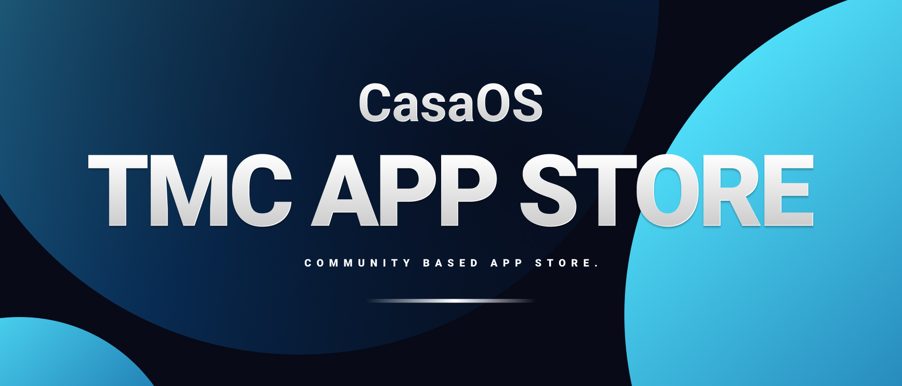
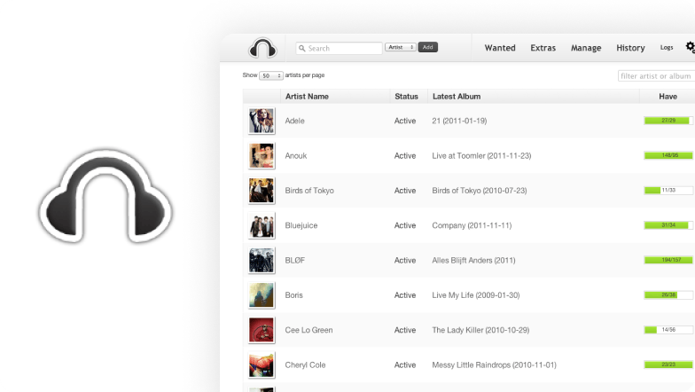
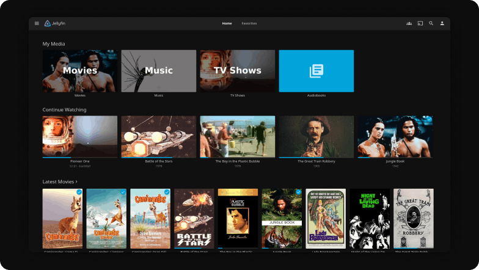
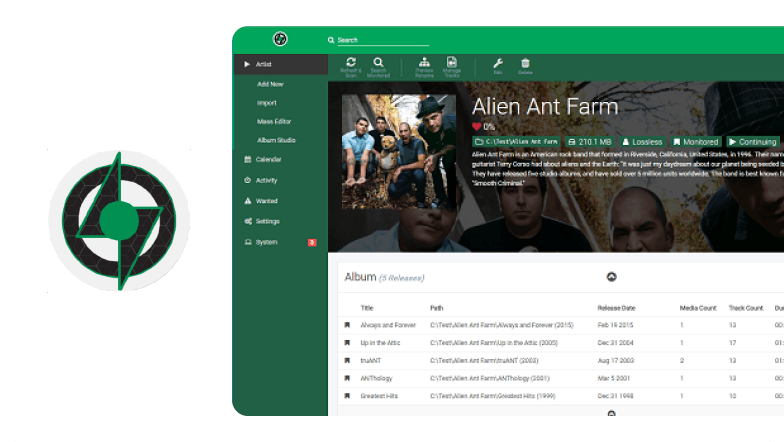
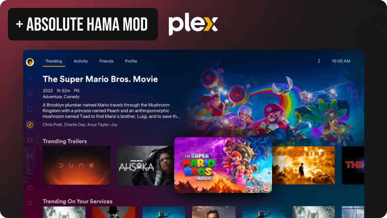
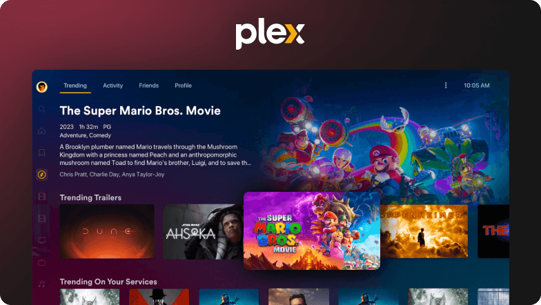
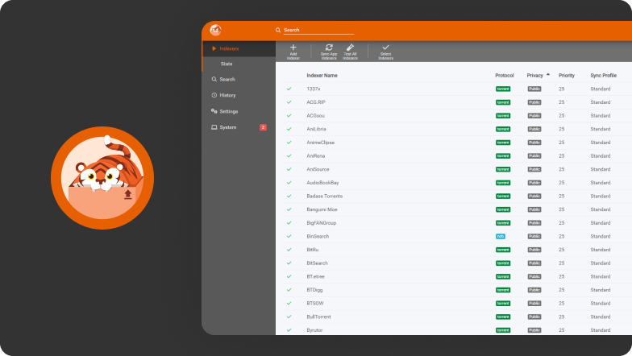
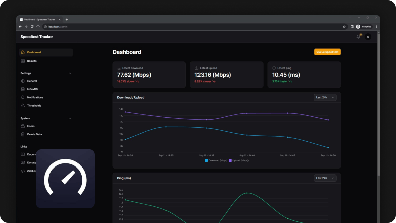
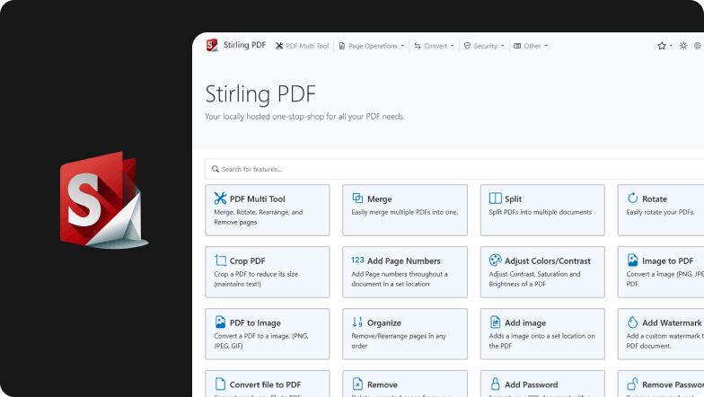
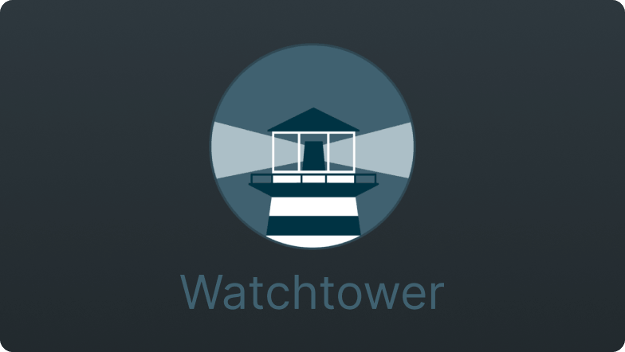

[](https://github.com/mariosemes/CasaOS-TMCstore/tree/traffic#-total-traffic-data-badge)
[](https://github.com/mariosemes/CasaOS-TMCstore/tree/traffic#-total-traffic-data-badge)
[](https://github.com/mariosemes/CasaOS-TMCstore/tree/traffic#-total-traffic-data-badge)
[](https://github.com/mariosemes/CasaOS-TMCstore/tree/traffic#-total-traffic-data-badge)

# ⭐ CasaOS TMC Community App Store
```Believe it or not, but yet another CasaOS Community App Store based mostly on my usage and apps.```

### What is CasaOS?
[CasaOS](https://www.casaos.io/) dances to its own tune, and it's not your run-of-the-mill operating system. Think of it as your very own home cloud maestro, choreographed within the Docker ecosystem and designed especially for your cozy abode. Its mission? Crafting the world's most effortlessly elegant, user-friendly home cloud system you've ever laid eyes on.
<br /><br />
**You can find me and many other great community members on the [official CasaOS Discord server.](https://discord.gg/Gx4BCEtHjx)**

[](https://www.casaos.io/)
[](https://github.com/IceWhaleTech/CasaOS)
[](https://discord.gg/Gx4BCEtHjx)

<br />

## ⚠️ Warning!

Please be aware that this Appstore is exclusively supported on CasaOS version 0.4.4 and above. If you are currently using an older version, you will need to upgrade to access this functionality. To upgrade your CasaOS version, please [click here](https://wiki.casaos.io/en/guides) for detailed instructions.

<br />

## ⬇️ Download URL:

    https://github.com/mariosemes/CasaOS-TMCstore/archive/refs/heads/main.zip

<br />

## 🔥 How to install:


<br />

## 📱 Apps:

| App | Thumbnail |
| :-- | --- |
| <h2> AdGuard Home</h2> [](https://github.com/AdguardTeam/AdGuardHome) [](https://adguard.com/) <br /> AdGuard Home is a network-wide software for blocking ads & tracking. After you set it up, it’ll cover ALL your home devices, and you don’t need any client-side software for that.  |  |
| <h2> AdGuard Sync</h2> [](https://github.com/bakito/adguardhome-sync/) [](https://hub.docker.com/r/linuxserver/adguardhome-sync) <br /> Adguardhome-sync is a tool to synchronize AdGuardHome config to replica instances. |  |
| <h2> Bazarr</h2> [](https://github.com/morpheus65535/bazarr) [](https://www.bazarr.media/) <br /> Bazarr is a companion application to Sonarr and Radarr that manages and downloads subtitles based on your requirements. |  |
| <h2> Changedetection.io + Playwright</h2> [](https://github.com/dgtlmoon/changedetection.io/pkgs/container/changedetection.io) [](https://changedetection.io/) <br /> From simply monitoring website pages that have a change (such as watching prices, restock notification), to deep inspection such as PDF text support, JSON and XML monitoring and extensive text triggers. |  |
| <h2> ChatPad AI</h2> [](https://github.com/deiucanta/chatpad/pkgs/container/chatpad) [](https://chatpad.ai/) <br /> Free and open-source software that provides a user-friendly system for interacting with ChatGPT. |  |
| <h2> Ghost</h2> [](https://hub.docker.com/_/ghost/) [](https://ghost.org/) <br /> Free and open-source blogging platform. |  |
| <h2> Headphones</h2> [](https://github.com/rembo10/headphones) [](https://lidarr.audio/) <br /> Headphones is an automated music downloader for NZB and Torrent, written in Python. It supports SABnzbd, NZBget, Transmission, µTorrent, Deluge and Blackhole. |  |
| <h2> iSponsorBlockTV</h2> [](https://github.com/dmunozv04/iSponsorBlockTV) [](https://github.com/dmunozv04/iSponsorBlockTV) <br /> Skip sponsor segments in YouTube videos playing on a YouTube TV device. |  |
| <h2> Jellyfin</h2> [](https://github.com/jellyfin/jellyfin) [](https://jellyfin.org/) <br /> Jellyfin is a Free Software Media System that puts you in control of managing and streaming your media. It is an alternative to the proprietary Emby and Plex, to provide media from a dedicated server to end-user devices via multiple apps. |  |
| <h2> Lidarr</h2> [](https://github.com/Lidarr/Lidarr) [](https://lidarr.audio/) <br /> Lidarr is a music collection manager for Usenet and BitTorrent users. It can monitor multiple RSS feeds for new albums from your favorite artists and will interface with clients and indexers to grab, sort, and rename them. It can also be configured to automatically upgrade the quality of existing files in the library when a better quality format becomes available. |  |
| <h2> Nextcloud (Extended)</h2> [](https://hub.docker.com/r/crazymax/nextcloud) [](https://github.com/crazy-max/docker-nextcloud) <br /> Nextcloud Docker image with advanced features. More info can be found here https://github.com/crazy-max/docker-nextcloud/tree/master |  |
| <h2> Plex</h2> [](https://github.com/plexinc) [](https://www.plex.tv/) <br /> A one-stop destination to stream movies, TV shows, and music, Plex is the most comprehensive entertainment platform available today. |  |
| <h2> Plex + Audnexus Mod</h2> [](https://github.com/djdembeck/Audnexus.bundle) [](https://www.plex.tv/) <br /> Plex + An audnex.us client, providing rich author and audiobook data to Plex via its legacy plugin agent system. |  |
| <h2> Plex + Absolute Hama Mod</h2> [](https://github.com/ZeroQI/Absolute-Series-Scanner) [](https://www.plex.tv/) <br /> Plex + Absolute Series Scanner and Hama Mod |  |
| <h2> Prowlarr</h2> [](https://github.com/Prowlarr/Prowlarr) [](https://prowlarr.com/) <br /> Sonarr is a popular open-source software application used for managing and automating the process of downloading, organizing, and tracking TV shows. |  |
| <h2> Radarr v4+</h2> [](https://github.com/Radarr/Radarr) [](https://radarr.video/) <br /> Radarr is a movie collection manager for Usenet and BitTorrent users. |  |
| <h2> Red Discord Bot</h2> [](https://github.com/Cog-Creators/Red-DiscordBot) [](https://github.com/Cog-Creators/Red-DiscordBot) <br /> Red is a fully modular bot – meaning all features and commands can be enabled/disabled to your liking, making it completely customizable. This is a self-hosted bot – meaning you will need to host and maintain your own instance. |  |
| <h2> Sonarr v4+</h2> [](https://github.com/Sonarr/Sonarr) [](https://sonarr.tv/) <br /> Sonarr is a popular open-source software application used for managing and automating the process of downloading, organizing, and tracking TV shows. |  |
| <h2> Speedtest Tracker</h2> [](https://github.com/alexjustesen/speedtest-tracker) [](https://docs.speedtest-tracker.dev/) <br /> Speedtest Tracker is a self-hosted internet performance tracking application that runs speedtest checks against Ookla's Speedtest service. |  |
| <h2> Stirling-PDF</h2> [](https://github.com/Frooodle/Stirling-PDF) [](https://sonarr.tv/) <br /> This is a powerful locally hosted web based PDF manipulation tool using docker that allows you to perform various operations on PDF files, such as splitting merging, converting, reorganizing, adding images, rotating, compressing, and more. |  |
| <h2> Unmanic</h2> [](https://hub.docker.com/r/josh5/unmanic/tags) [](https://docs.unmanic.app/) <br /> Unmanic is a simple tool for optimising your file library. You can use it to convert your files into a single, uniform format, manage file movements based on timestamps, or execute custom commands against a file based on its file size. |  |
| <h2> Watchtower</h2> [](https://github.com/containrrr/watchtower/) [](https://containrrr.dev/watchtower/) <br /> A container-based solution for automating Docker container base image updates. |  |
